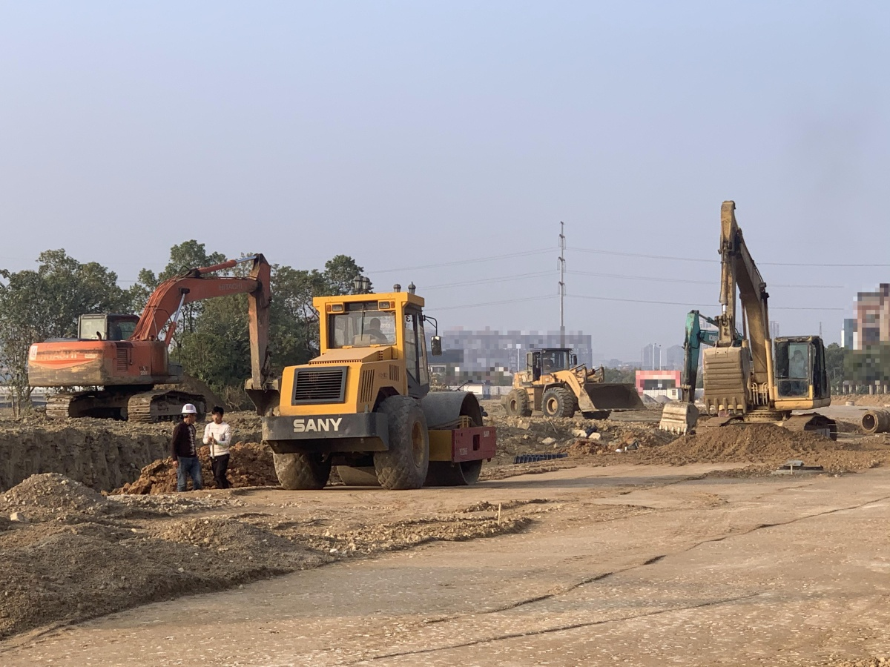

# ConstructionSite 10k – Implementation Repository

This repository contains implementation scripts and utilities for working with the **ConstructionSite 10k** dataset, a vision-language dataset designed for construction inspection tasks.  

The dataset is hosted on 🤗 [Hugging Face Datasets: ConstructionSite 10k](https://huggingface.co/datasets/LouisChen15/ConstructionSite) and provides **10,013 construction site images** with rich annotations for captioning, safety violation detection, VQA, and visual grounding for Visual Language Model (VLM) training and testing.

---

## 📖 Dataset Summary

- **Total images:** 10,013  
- **Splits:**  
  - Training: 7,009 images  
  - Test: 3,004 images  

The dataset is curated to evaluate how well **vision-language models (VLMs)** can understand construction site images and reason about **safety compliance**.  

If you use this dataset, please cite the accompanying work (see [Citation](#-citation)).

---

## 💻 Tasks & Annotations

The dataset supports multiple vision-language tasks:

### 1. Image Captioning
- Each image is paired with a **detailed caption**.
- Captions were manually written for ~2,000 images and generated (with GPT-4 + human refinement) for the rest.
- Unlike MSCOCO, captions here emphasize **background context** and **construction-specific details**.

### 2. Safety Rule Violation VQA
- Task: Detect whether a safety violation is present and provide reasoning.  
- If a violation is found, the dataset provides:
  - **Violated rule ID**  
  - **Bounding box** of violator  
  - **One- to two-sentence reasoning**  

**Safety Rules:**
| Rule ID | Content |
|---------|---------|
| 1 | Use of basic PPE (hard hats, safety glasses, vests, protective clothing, etc.). |
| 2 | Use of safety harness when working ≥3m high without edge protection. |
| 3 | Use of edge protection (guardrails, fences) in underground projects ≥3m depth. |
| 4 | No workers within excavator blind spots or operating radius. |

### 3. Visual Grounding
Models must predict bounding boxes for:
- Excavators  
- Rebars  
- Workers wearing **white hard hats**  

### 4. Image Attributes
Each image includes four attributes:
- `illumination`  
- `camera_distance`  
- `view`  
- `quality_of_info`  

---

## 📑 Dataset Structure

Example annotation for image **0000424.jpg**:


```json
{
  "image_id": "0000424",
  "image_caption": "There are two excavators, a loader, and a drum roller in the image. There are two workers on the left of the image, one of the workers is wearing a white hard hat.",
  "illumination": "normal lighting",
  "camera_distance": "mid distance",
  "view": "elevation view",
  "quality_of_info": "rich info",
  "rule_1_violation": {
    "bounding_box": [[0.22, 0.59, 0.28, 0.75]], 
    "reason": "The worker with a white sweatshirt on the left is not wearing a hard hat."
  },
  "rule_2_violation": null,
  "rule_3_violation": null,
  "rule_4_violation": null,
  "excavator": [[0.03, 0.38, 0.32, 0.63],[0.79, 0.3 , 0.94, 0.67],[0.74, 0.46, 0.84, 0.65]],
  "rebar": [],
  "worker_with_white_hard_hat": [[0.19, 0.6 , 0.23, 0.74]]
}
```

## 🚀 Getting Started
- Please refer to the respective Vision-Language Model repositories for their dependency requirements to run inferences.
- Installing the dependencies for this repository should be straightforward and on a need-to-use basis; therefore, they are not listed in this repository.
- The Java file for the **SPICE** evaluation metric (used for image captioning) has been modified to support longer captions and prevent subprocess crashes.

## 📂 Repository Structure

### Dataset Loading
Refer to the [🤗 Hugging Face Datasets documentation](https://huggingface.co/docs/datasets/en/index) for tutorials on how to download, process, and explore the dataset.

### `10k_images/`
This folder should contain the construction site images downloaded from the Hugging Face dataset in order to run the inference code.

### `Annotations/`
This folder contains sample annotations from the test set to illustrate the expected format and structure required for running the evaluation scripts in the `Evaluations/` folder.  

### `Evaluations/`
- Includes evaluation and helper scripts for all tasks described above and in our [paper](#citation).  
- Contains testing results from the **Gemini-2.5-Flash** model for demonstration.  
- Provides **Jupyter Notebooks** that illustrates how to use the evaluation scripts step-by-step.  

### `Inferences/`
- Contains inference scripts for **Gemini-2.5-Flash** across the three main tasks.  
- The code was developed in mid-2024 and is intended primarily for **inference and prompt-engineering examples**.  
- Vision-language models evolve rapidly; for the latest inference or training implementations, please refer to their respective official repositories.

## 📜 Citation

```bibtex
@misc{chen2025largepretrainedvisionlanguage,
  title        = {Are Large Pre-trained Vision Language Models Effective Construction Safety Inspectors?}, 
  author       = {Xuezheng Chen and Zhengbo Zou},
  year         = {2025},
  eprint       = {2508.11011},
  archivePrefix= {arXiv},
  primaryClass = {cs.CV},
  url          = {https://arxiv.org/abs/2508.11011},
}
```